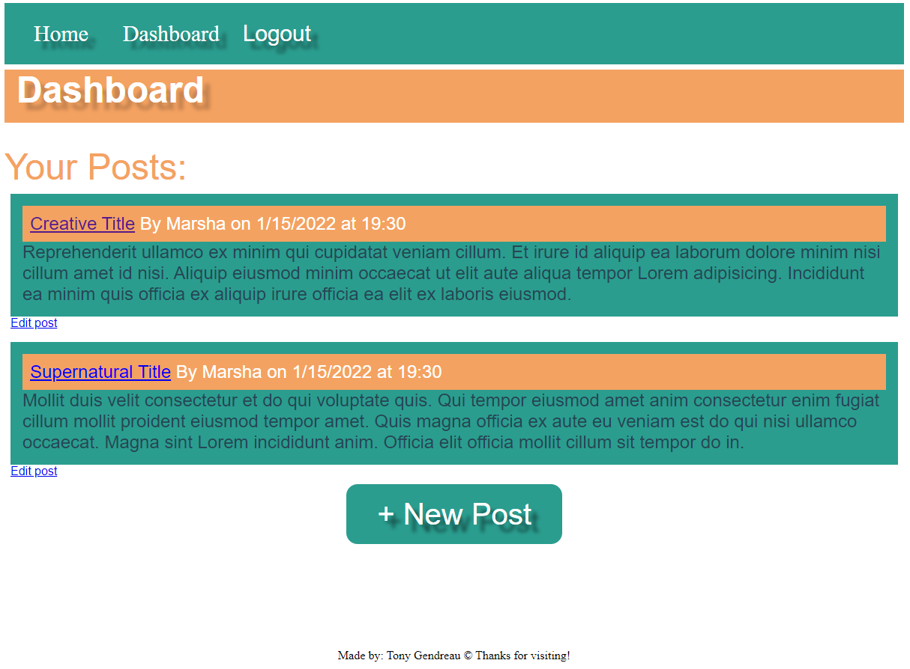

# Nerd News
---

  
  
   
   
   
   
   
   
## Description

This app is designed to be used as a blogging site.  It allows for users to create accounts and then write their own posts, as well as comment on other's posts.

---
  ## Table of Contents

  [Features](#features)

  [Screenshot](#screenshot)

  [Installation](#installation)
    
  [Usage](#usage)
    
  [License](#license)
    
  [Contributing](#contributing)
    
  [Tests](#tests)

  [Questions](#questions)
  
  

---

## Features

      1. Complete MVC Application 

      2. Views written in HTML, CSS, and Javascript

      3. Models written with MySQL and Sequelize

      4. Controllers written with Express and Node.js
---

## Screenshot 
  
  
  

  ---

  ## Installation

      1. Either clone from my github or run on Heroku with the Live Link below! 

   &emsp;[Live Link](https://tgtiburon-nerdnews.herokuapp.com/) 

---
  ## Usage

      1. If you clone the repo: type npm -install 

      2. type npm start 

  ---
  ## License 

  &emsp; 

      To read about the license of this project click the link below.

  &emsp;[License](https://github.com/tgtiburon/NerdNews/blob/main/LICENSE) 

  ---
  ## Contributing

      1. Email me or contact me via the Issues tracker on Github 
---
  ## Tests
      1. Type npm test in the console 

---
## Questions

If you have any questions about this project feel free to email me at <tg.tiburon@gmail.com>.  

To see the rest of my portfolio, visit [Github](https://github.com/tgtiburon).

Below is a graphic displaying my most used languages on github.

This Readme file was created with Readme Architect by Tony Gendreau &copy;
